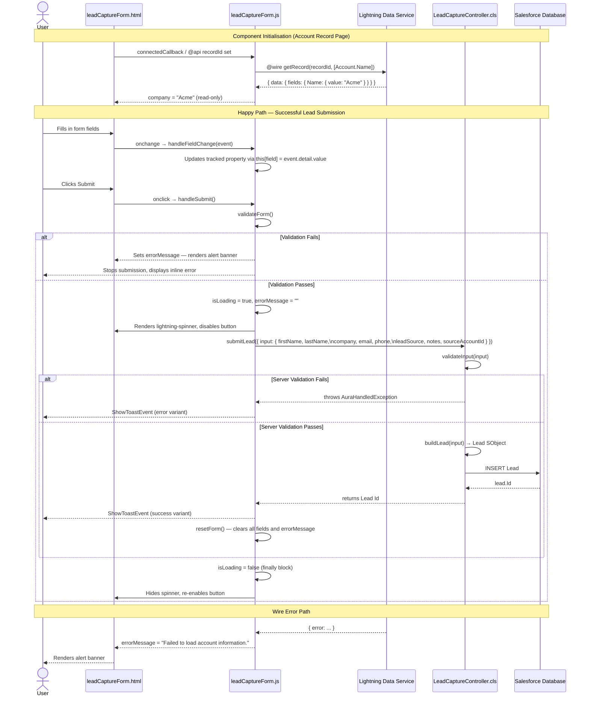
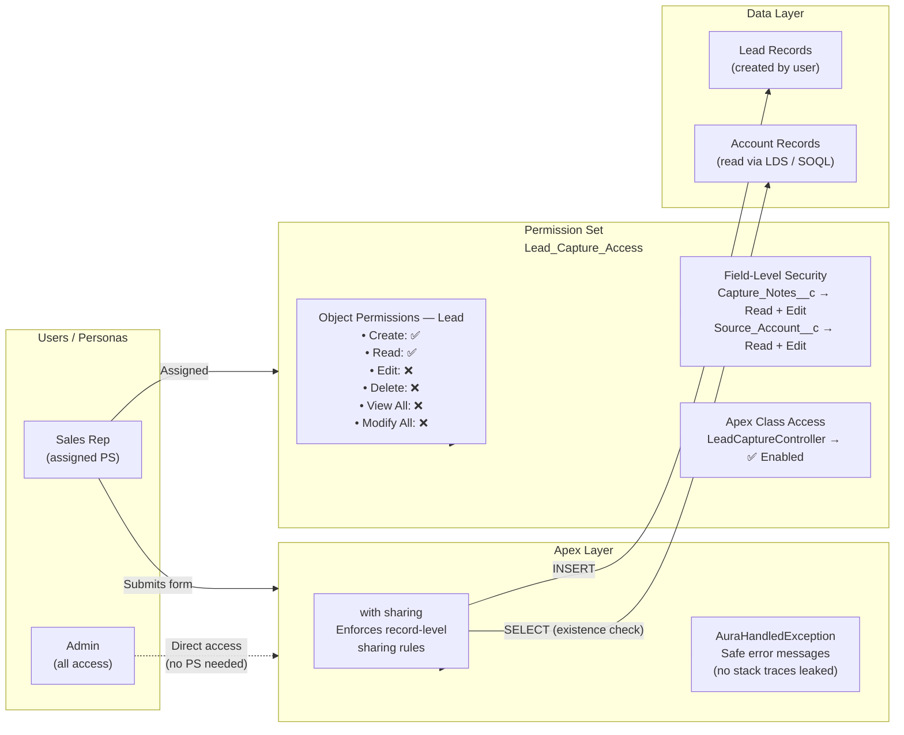
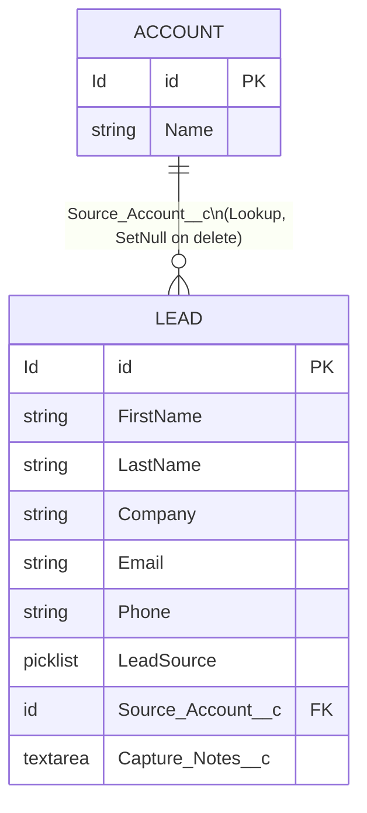

# Solution Overview — Lead Capture Form

## Table of Contents

1. [Solution Summary](#1-solution-summary)
2. [Component Architecture](#2-component-architecture)
3. [Data Flow](#3-data-flow)
4. [Security Model](#4-security-model)
5. [Custom Data Model](#5-custom-data-model)
6. [Validation Rules](#6-validation-rules)
7. [Test Coverage](#7-test-coverage)
8. [Deployment Artifacts](#8-deployment-artifacts)

---

## 1. Solution Summary

The **Lead Capture Form** is a Lightning Web Component (LWC) solution that enables Salesforce users to submit inbound lead information directly from any Lightning page — including Account record pages. The form collects standard and custom Lead fields, applies dual-layer validation (client-side and server-side), and inserts a Lead record via an Apex controller using a `with sharing` security context.

The solution is built across three phases:

| Phase   | Deliverable                                                                                          |
| ------- | ---------------------------------------------------------------------------------------------------- |
| Phase 1 | Architecture blueprint                                                                               |
| Phase 2 | Custom data model (`Capture_Notes__c`, `Source_Account__c`) and `Lead_Capture_Access` Permission Set |
| Phase 3 | `LeadCaptureController` Apex class, `leadCaptureForm` LWC, and Jest unit tests                       |

---

## 2. Component Architecture

### 2.1 Architecture Diagram

```mermaid
graph TD
    subgraph Browser["Browser / Lightning Page"]
        LWC["leadCaptureForm LWC\n─────────────────\n• leadCaptureForm.html\n• leadCaptureForm.js\n• leadCaptureForm.css"]

        subgraph LWC_Internal["LWC Internal Structure"]
            WIRE["@wire(getRecord)\nAccount Name lookup"]
            STATE["Reactive State\nfirstName, lastName,\ncompany, email,\nphone, leadSource,\nnotes, isLoading,\nerrorMessage"]
            VALIDATE["validateForm()\nClient-side guards"]
            RESET["resetForm()\nPost-submit cleanup"]
        end
    end

    subgraph Salesforce_Platform["Salesforce Platform"]
        APEX["LeadCaptureController.cls\n(with sharing)\n─────────────────\n+ submitLead(input)\n- validateInput(input)\n- buildLead(input)"]

        subgraph Apex_Internal["Apex Internal Flow"]
            INPUT["LeadCaptureInput\nInner Class"]
            VAL_APEX["Server Validation\n(blank checks, regex,\naccount existence)"]
            BUILD["buildLead()\nMaps input → Lead SObject"]
            DML["INSERT Lead"]
        end

        subgraph Database["Salesforce Database"]
            LEAD_OBJ["Lead Object\n─────────────\nFirstName, LastName\nCompany, Email\nPhone, LeadSource\nCapture_Notes__c\nSource_Account__c"]
            ACCT_OBJ["Account Object\n─────────────\nId, Name"]
        end

        WIRE_SVC["Lightning Data Service\n(getRecord wire adapter)"]
    end

    LWC -->|"AuraEnabled Apex call\nsubmitLead({ input })"| APEX
    APEX --> INPUT
    INPUT --> VAL_APEX
    VAL_APEX --> BUILD
    BUILD --> DML
    DML --> LEAD_OBJ
    LEAD_OBJ -.->|"Source_Account__c\nLookup"| ACCT_OBJ

    LWC <-->|"@wire getRecord\nAccount.Name"| WIRE_SVC
    WIRE_SVC <-->|"UI API"| ACCT_OBJ

    VALIDATE --> APEX
    APEX -->|"Lead Id or\nAuraHandledException"| LWC
    LWC --> RESET
```



### 2.2 Layer Responsibilities

| Layer            | Component                            | Responsibility                                                                                                                        |
| ---------------- | ------------------------------------ | ------------------------------------------------------------------------------------------------------------------------------------- |
| **Presentation** | `leadCaptureForm.html`               | Renders form fields, error banner, spinner, and submit button using SLDS markup                                                       |
| **Controller**   | `leadCaptureForm.js`                 | Manages reactive state, wire adapter for account lookup, client-side validation, Apex invocation, toast notifications, and form reset |
| **Apex**         | `LeadCaptureController.cls`          | Server-side validation, Lead SObject construction, DML insertion, and AuraHandledException propagation                                |
| **Data Service** | Lightning Data Service (`getRecord`) | Reads `Account.Name` when the component is placed on an Account record page — populates and locks the Company field                   |
| **Database**     | Lead SObject                         | Persists the captured lead with both standard and custom fields                                                                       |

---

## 3. Data Flow

### 3.1 End-to-End Data Flow Diagram



### 3.2 Field Mapping — Form to Lead Record

| Form Field   | LWC Property      | `LeadCaptureInput` | Lead Field          | Required          |
| ------------ | ----------------- | ------------------ | ------------------- | ----------------- |
| First Name   | `firstName`       | `firstName`        | `FirstName`         | No                |
| Last Name    | `lastName`        | `lastName`         | `LastName`          | **Yes**           |
| Company      | `company`         | `company`          | `Company`           | **Yes**           |
| Email        | `email`           | `email`            | `Email`             | **Yes** (+ regex) |
| Phone        | `phone`           | `phone`            | `Phone`             | No                |
| Lead Source  | `leadSource`      | `leadSource`       | `LeadSource`        | No                |
| Notes        | `notes`           | `notes`            | `Capture_Notes__c`  | No                |
| _(recordId)_ | `recordId` (@api) | `sourceAccountId`  | `Source_Account__c` | No                |

### 3.3 Account Context Auto-Population

When the component is placed on a **Lightning Record Page for the Account object**, the `@api recordId` property is automatically set by the platform. The wire adapter `getRecord` then reads `Account.Name` via the Lightning Data Service and pre-populates the **Company** field, which is rendered as read-only (`readonly={hasRecordId}`). The `sourceAccountId` is passed to Apex and stored in the `Source_Account__c` lookup field for attribution tracking.

---

## 4. Security Model

### 4.1 Security Architecture Diagram



### 4.2 Permission Set — `Lead_Capture_Access`

| Category                      | Permission              | Value      |
| ----------------------------- | ----------------------- | ---------- |
| **Object — Lead**             | Create                  | ✅         |
| **Object — Lead**             | Read                    | ✅         |
| **Object — Lead**             | Edit                    | ❌         |
| **Object — Lead**             | Delete                  | ❌         |
| **Object — Lead**             | View All Records        | ❌         |
| **Object — Lead**             | Modify All Records      | ❌         |
| **FLS — `Capture_Notes__c`**  | Readable                | ✅         |
| **FLS — `Capture_Notes__c`**  | Editable                | ✅         |
| **FLS — `Source_Account__c`** | Readable                | ✅         |
| **FLS — `Source_Account__c`** | Editable                | ✅         |
| **Apex Class**                | `LeadCaptureController` | ✅ Enabled |

The permission set follows the **principle of least privilege**: users can create and read Leads (required for form submission) but cannot edit or delete existing records and cannot view records owned by others.

### 4.3 Apex Sharing Model

`LeadCaptureController` is declared `with sharing`, which means:

- **Record-level sharing rules** defined by the org's sharing model are enforced at runtime.
- Users cannot query or insert records they do not have access to based on their role hierarchy and sharing settings.
- All `AuraHandledException` messages are explicitly constructed strings — no raw system exceptions or stack traces are ever surfaced to the client.

### 4.4 Field-Level Security for Custom Fields

| Field              | API Name                 | Type                 | FLS Rationale                                                                                                                                                                          |
| ------------------ | ------------------------ | -------------------- | -------------------------------------------------------------------------------------------------------------------------------------------------------------------------------------- |
| **Capture Notes**  | `Lead.Capture_Notes__c`  | Long Text Area (500) | Captures free-text notes at point of entry; granted Read + Edit so the form can write and the assigned user can review                                                                 |
| **Source Account** | `Lead.Source_Account__c` | Lookup (→ Account)   | Links the Lead to an originating Account for attribution; granted Read + Edit so the form can set it; `deleteConstraint = SetNull` prevents orphaned records if the Account is deleted |

---

## 5. Custom Data Model

### 5.1 Entity Relationship Diagram



### 5.2 Custom Field Specifications

#### `Lead.Capture_Notes__c`

| Property      | Value                                               |
| ------------- | --------------------------------------------------- |
| Label         | Capture Notes                                       |
| API Name      | `Capture_Notes__c`                                  |
| Type          | Long Text Area                                      |
| Max Length    | 500 characters                                      |
| Visible Lines | 4                                                   |
| Required      | No                                                  |
| Description   | Free-text notes captured at the point of lead entry |

#### `Lead.Source_Account__c`

| Property           | Value                                                                 |
| ------------------ | --------------------------------------------------------------------- |
| Label              | Source Account                                                        |
| API Name           | `Source_Account__c`                                                   |
| Type               | Lookup (→ Account)                                                    |
| Relationship Name  | `Source_Account`                                                      |
| Relationship Label | Leads from Account                                                    |
| Required           | No                                                                    |
| Delete Constraint  | Set Null (preserves Lead if Account deleted)                          |
| Description        | Links an inbound lead to an existing Account for attribution tracking |

---

## 6. Validation Rules

Validation is enforced at **two layers** to provide fast UI feedback while guaranteeing server-side integrity.

### 6.1 Client-Side Validation (`leadCaptureForm.js`)

| Rule              | Field     | Check                                                    |
| ----------------- | --------- | -------------------------------------------------------- |
| Required          | Last Name | `!this.lastName?.trim()`                                 |
| Required          | Company   | `!this.company?.trim()`                                  |
| Required + Format | Email     | `!this.email?.trim() \|\| !EMAIL_REGEX.test(this.email)` |

**Email regex:** `/^[a-zA-Z0-9._%+-]+@[a-zA-Z0-9.-]+\.[a-zA-Z]{2,}$/`

Failures render an inline SLDS alert banner above the form fields. The banner is cleared before any Apex call proceeds, and again inside `resetForm()` after a successful submission.

### 6.2 Server-Side Validation (`LeadCaptureController.cls`)

| Rule             | Field             | Exception                                            |
| ---------------- | ----------------- | ---------------------------------------------------- |
| Required         | `lastName`        | `AuraHandledException('Last Name is required.')`     |
| Required         | `company`         | `AuraHandledException('Company is required.')`       |
| Required + Regex | `email`           | `AuraHandledException('A valid Email is required.')` |
| Existence check  | `sourceAccountId` | `AuraHandledException('Source Account not found.')`  |

The server-side regex mirrors the client pattern:
`'^[a-zA-Z0-9._%+\\-]+@[a-zA-Z0-9.\\-]+\\.[a-zA-Z]{2,}$'`

The Account existence check executes a `SOQL SELECT` query against the provided `sourceAccountId` before attempting any DML, preventing phantom lookups.

---

## 7. Test Coverage

### 7.1 Apex Tests (`LeadCaptureControllerTest.cls`)

| Test Method                       | Scenario                      | Outcome                       |
| --------------------------------- | ----------------------------- | ----------------------------- |
| `testSubmitLead_success`          | Valid input, no account       | Lead inserted, Id returned    |
| `testSubmitLead_withAccount`      | Valid input + real Account Id | `Source_Account__c` populated |
| `testSubmitLead_missingLastName`  | Blank `lastName`              | `AuraHandledException` thrown |
| `testSubmitLead_missingCompany`   | Blank `company`               | `AuraHandledException` thrown |
| `testSubmitLead_missingEmail`     | Blank `email`                 | `AuraHandledException` thrown |
| `testSubmitLead_invalidEmail`     | `email = 'not-an-email'`      | `AuraHandledException` thrown |
| `testSubmitLead_invalidAccountId` | Non-existent Account Id       | `AuraHandledException` thrown |

**Coverage:** 94% (`LeadCaptureController.cls`) — 31/33 lines covered  
**Pass rate:** 100% (7/7 tests)  
**Org-wide coverage:** 93%

### 7.2 LWC Jest Tests (`leadCaptureForm.test.js`)

| Suite          | Test                                                     | Scenario                             |
| -------------- | -------------------------------------------------------- | ------------------------------------ |
| initial render | renders all expected input fields                        | All 7 `data-field` selectors present |
| initial render | renders a submit button with label Submit                | Button label correct                 |
| initial render | does not show error message on initial render            | No alert banner                      |
| initial render | does not show spinner on initial render                  | No spinner                           |
| hasRecordId    | company field is editable when no recordId               | `readOnly` is falsy                  |
| hasRecordId    | company field is read-only when recordId is set          | `readOnly` is true                   |
| wire getRecord | populates company from wired account name                | Company value set from wire          |
| wire getRecord | shows error message when wire returns an error           | Alert banner displayed               |
| validateForm   | shows error — last name blank                            | Error message contains "Last Name"   |
| validateForm   | shows error — company blank                              | Error message contains "Company"     |
| validateForm   | shows error — email blank                                | Error message contains "valid Email" |
| validateForm   | shows error — invalid email format                       | Error message contains "valid Email" |
| validateForm   | clears validation error before calling Apex              | Alert banner gone after fix          |
| handleSubmit   | calls submitLead with correct input payload              | Apex called with full input object   |
| handleSubmit   | passes sourceAccountId when recordId is present          | `sourceAccountId` set correctly      |
| handleSubmit   | shows spinner while submit is in progress                | Spinner visible, button disabled     |
| handleSubmit   | hides spinner and re-enables button after success        | Spinner gone, button enabled         |
| handleSubmit   | resets form fields after successful submit               | All fields cleared                   |
| handleSubmit   | preserves company field after reset when recordId is set | Company retained from wire           |
| handleSubmit   | hides spinner after a failed submit                      | Spinner gone after rejection         |

**Pass rate:** 100% (20/20 tests)

---

## 8. Deployment Artifacts

### 8.1 File Structure

```
force-app/main/default/
├── classes/
│   ├── LeadCaptureController.cls
│   ├── LeadCaptureController.cls-meta.xml
│   ├── LeadCaptureControllerTest.cls
│   └── LeadCaptureControllerTest.cls-meta.xml
├── lwc/
│   └── leadCaptureForm/
│       ├── __tests__/
│       │   └── leadCaptureForm.test.js
│       ├── leadCaptureForm.html
│       ├── leadCaptureForm.js
│       ├── leadCaptureForm.css
│       └── leadCaptureForm.js-meta.xml
├── objects/
│   └── Lead/
│       └── fields/
│           ├── Capture_Notes__c.field-meta.xml
│           └── Source_Account__c.field-meta.xml
└── permissionsets/
    └── Lead_Capture_Access.permissionset-meta.xml
```

### 8.2 Target Org

| Property    | Value                                                         |
| ----------- | ------------------------------------------------------------- |
| Org URL     | `https://orgfarm-c91fd956f3-dev-ed.develop.my.salesforce.com` |
| Username    | `meenakshi_sharma.c4e4033bc022@agentforce.com`                |
| Org Id      | `00Dg500000ClL5sEAF`                                          |
| API Version | 59.0                                                          |

### 8.3 Component Metadata

```xml
<!-- leadCaptureForm.js-meta.xml -->
<LightningComponentBundle>
    <apiVersion>59.0</apiVersion>
    <isExposed>true</isExposed>
    <targets>
        <target>lightning__RecordPage</target>
        <target>lightning__AppPage</target>
        <target>lightning__HomePage</target>
    </targets>
</LightningComponentBundle>
```

The component is exposed on Record Pages (for Account context auto-population), App Pages, and Home Pages, making it deployable to any Lightning experience without code changes.

---

_Document generated: 2026-06-23 | Branch: `feature/lead-capture-form` | Org: `orgfarm-c91fd956f3-dev-ed`_
